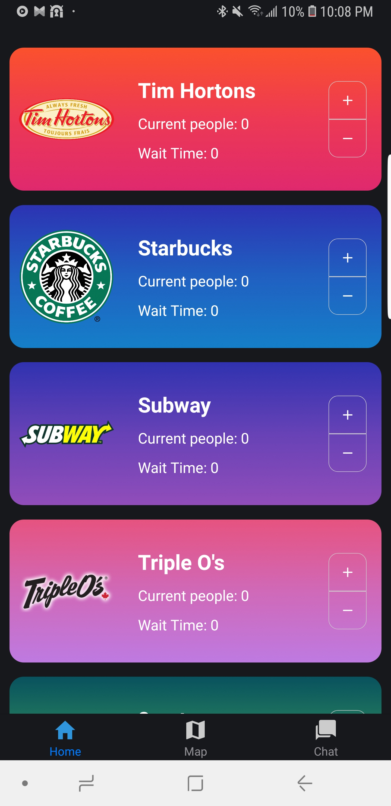
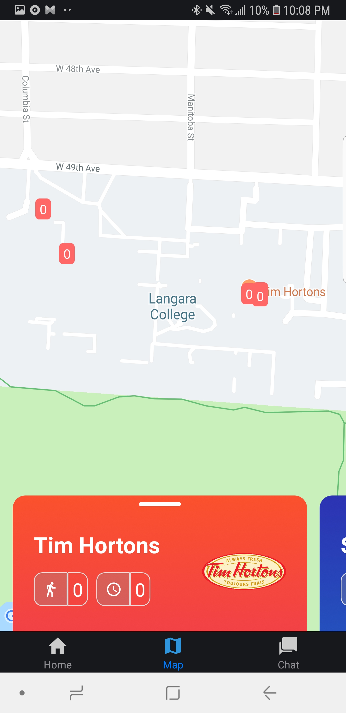
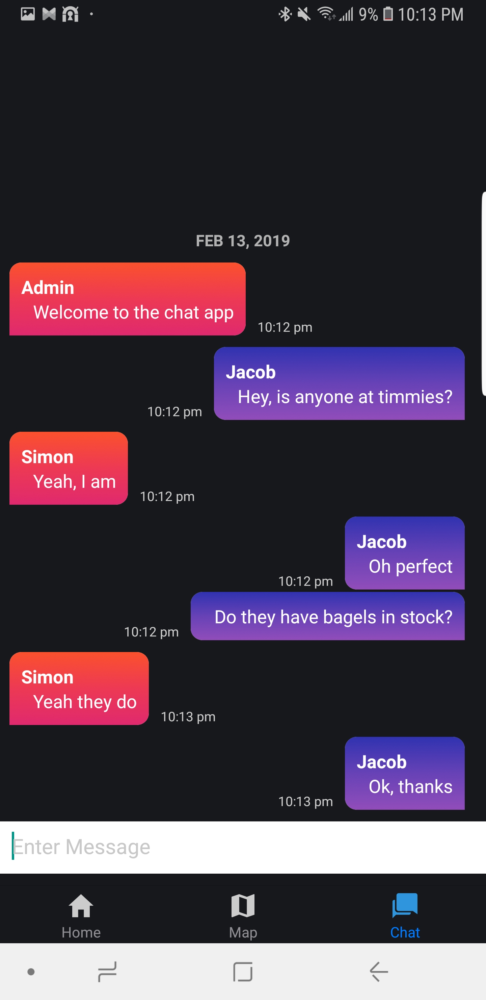

# College-Food-Court-App

This app shows the total size of queue for Langara college's food court restaurants and tells the average time it will take for you to place your order. This app is managed by community so the queue size can be updated by anyone. It has group chat functionality as well. I used the following frameworks:

- React-native
- Socket.io

  

